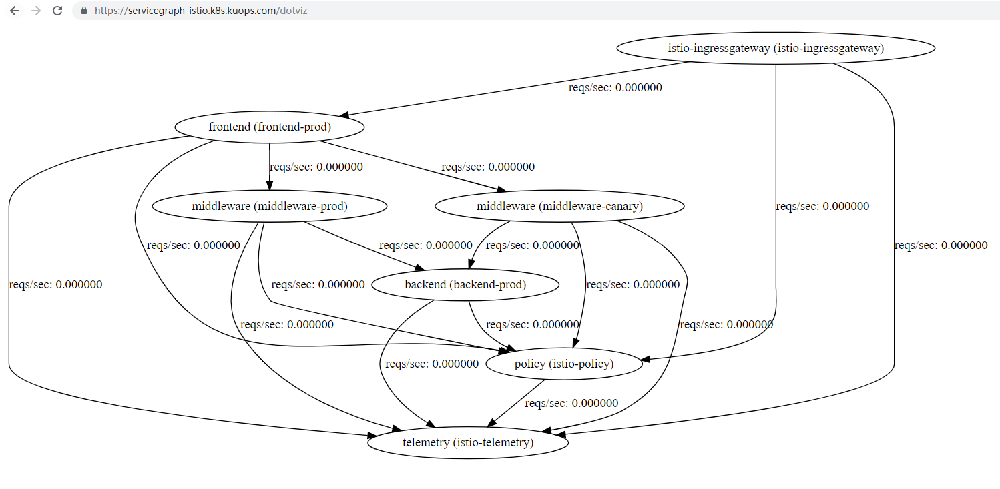
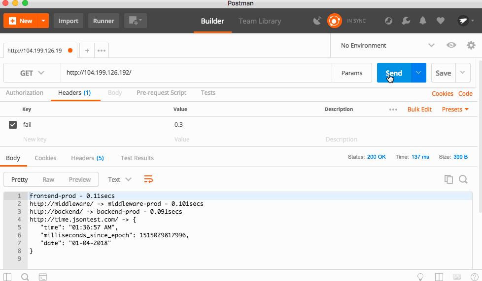
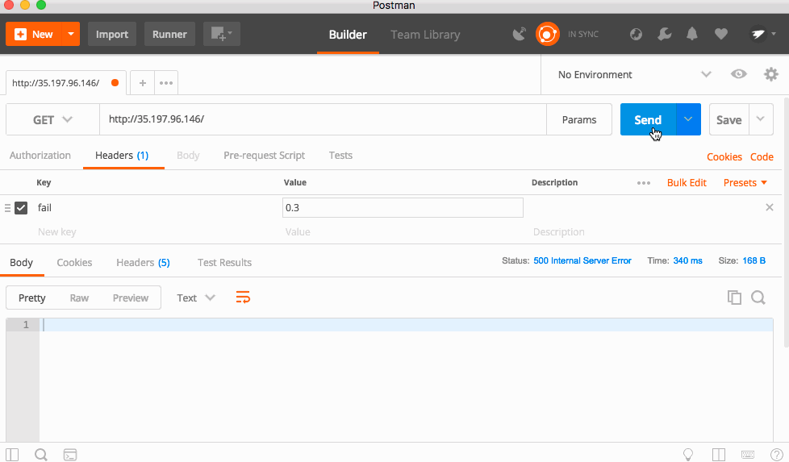
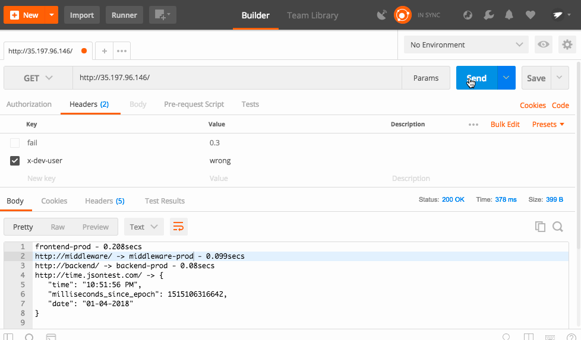
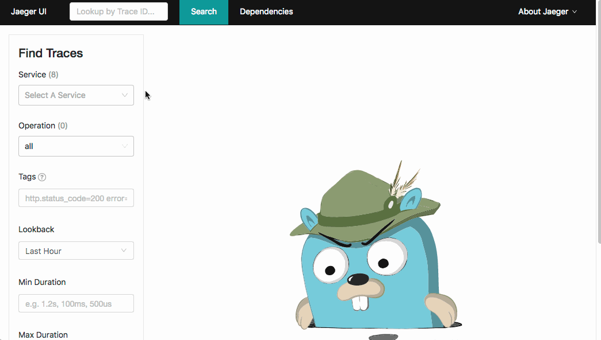
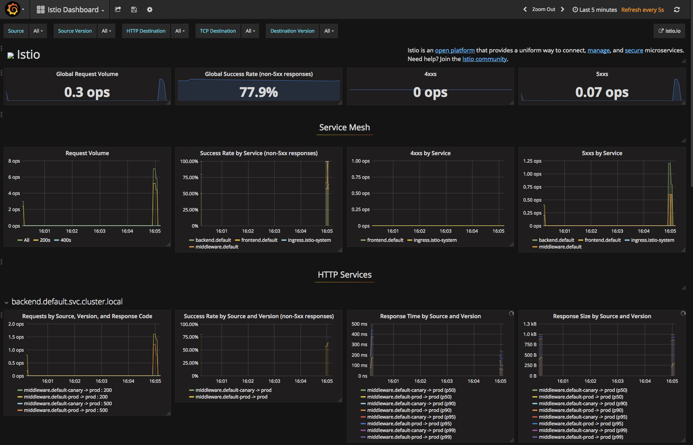
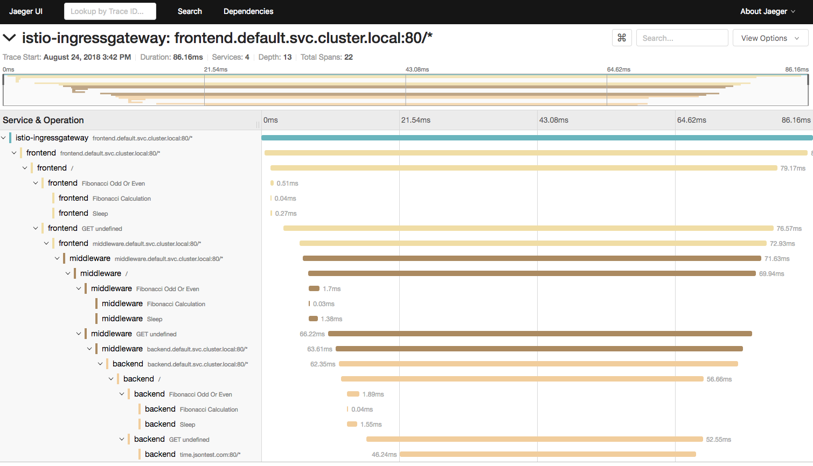

# Istio and OpenCensus 101 - Lightning Demo


forked from [thesandlord/Istio101](https://github.com/thesandlord/Istio101)


练习此任务之前，需要安装 kubernetes 和 istio ，可以参考 [vagrant-kubeadm](https://github.com/kuops/vagrant-kubeadm)，初始化一个集群


## Code

Code 作用是，向下游服务生成一个请求，获取请求结果，并且把 name ，延迟信息，和 下游 url 连接起来


## build 镜像

```
# 克隆代码

git clone https://github.com/kuops/Istio101.git

# 更改为自己的 repo 名称
DOCKER_REPO=kuopsme

# Build Docker 镜像
cd Istio101
docker build -t ${DOCKER_REPO}/istiotest:1.0 ./code/code-only-istio
docker build -t ${DOCKER_REPO}/istio-opencensus-simple:1.0 ./code/code-opencensus-simple
docker build -t ${DOCKER_REPO}/istio-opencensus-full:1.0 ./code/code-opencensus-full
docker push ${DOCKER_REPO}/istiotest:1.0
docker push ${DOCKER_REPO}/istio-opencensus-simple:1.0
docker push ${DOCKER_REPO}/istio-opencensus-full:1.0
```

> 这三个镜像，一个用于 `vanilla Istio` 演示，其余两个用于 `OpenCensus` 演示


## 部署 kubernetes Service

```
kubectl apply -f ./configs/kube/services.yaml
sed "s@<DOCKER_REPO>@${DOCKER_REPO}@g" ./configs/kube/deployments.yaml | kubectl apply -f -
```


查看部署状态

```
kubectl get pods && kubectl get svc && kubectl get svc -n istio-system istio-ingressgateway
NAME                                 READY   STATUS      RESTARTS   AGE
backend-prod-d6668447f-55m9p         2/2     Running     0          6m47s
frontend-prod-5555b65f65-rr5sd       2/2     Running     0          6m47s
middleware-canary-546bf48565-czhkr   2/2     Running     0          6m47s
middleware-prod-569c49569-58r66      2/2     Running     0          6m47s
NAME              TYPE        CLUSTER-IP       EXTERNAL-IP   PORT(S)                              AGE
backend           ClusterIP   10.105.20.225    <none>        80/TCP,9464/TCP                      7m11s
frontend          ClusterIP   10.101.188.197   <none>        80/TCP,9464/TCP                      7m11s
middleware        ClusterIP   10.99.47.19      <none>        80/TCP,9464/TCP                      7m11s
NAME                   TYPE           CLUSTER-IP     EXTERNAL-IP   PORT(S)                                                                                                                   AGE
istio-ingressgateway   LoadBalancer   10.99.78.215   10.0.7.110    80:31380/TCP,443:31390/TCP,31400:31400/TCP,15011:31104/TCP,8060:32276/TCP,853:32744/TCP,15030:30303/TCP,15031:32543/TCP   141m
```

> 由于 istio 使用了自动注入模式，所以创建的 Pod 无需任何操作，将自动通过 istio sidecar 进行流量代理


## 使用 istio 管理服务

我们使用 istio 来进行流量管理，istio 使用 ingresgateway 来管理服务:

```
kubectl create -f ./configs/istio/ingress.yaml
```
此文件此文件包含两个对象。第一个对象是 Gateway ，它允许我们绑定到集群中存在的 `istio-ingressgateway`，
第二个对象是 `VirtualService` ,让我们应用路由规则。由于我们在 Gateway 中 hosts 使用了通配符 `*` ,
代表所有的流量都通过该网关进行代理，又由于我们 `VirtualService` 只有一个路由规则，将流量都代理到了 `frontend` 的 service 上


现在我们访问 `istio-ingressgateway` 的 EXTERNAL-IP ，就可以访问到服务了,下面是我们服务的返回结果

```
frontend-prod - 0.287secs
http://middleware/ -> middleware-canary - 0.241secs
http://backend/ -> backend-prod - 0.174secs
http://time.jsontest.com/ -> StatusCodeError: 404 - ""
```

你可以看到 frontend service 请求了 middleware service, middleware 请求了后端，后端请求了 `time.jsontest.com`


## 修复 404

您可能会注意到 time.jsontest.com 正在返回 404.这是因为默认情况下，Istio 会阻止群集中的所有 Egress 流量。这是一种很好的安全措施，因为它可以防止恶意代码调用或您的代码与未经验证的第三方服务进行通信。

我们创建 ServiceEntry 允许对 `time.jsontest.com` 的访问

```
kubectl apply -f ./configs/istio/egress.yaml
```

现在，我们再访问，服务就正常了

```
frontend-prod - 0.172secs
http://middleware/ -> middleware-canary - 0.154secs
http://backend/ -> backend-prod - 0.142secs
http://time.jsontest.com/ -> {
   "time": "12:43:09 AM",
   "milliseconds_since_epoch": 1515026589163,
   "date": "01-04-2018"
}
```


## 修复 Flip Flop

当你刷新页面时，会发现 middleware 服务，会在两个版本之间随机调用，`middleware-canary` 和 `middleware-prod` 这是因为 service 选择的标签为 `app: middleware` ，这两个 deployment 都有此标签,这是一个非常强大的功能，可以使我们执行 Blue-Green 和 Canay 操作，使用 Servicegraph 我们可以直观的看到它。

打开 Servicegraph `http://servicegraph:8088/dotviz`

你应该能看到如下




你可以看到，流量从 frontend (prod), 发动到了 middleware (prod) 或 middleware (canary), 最后发送到了 backend (prod) 

使用 istio ，你可以使用 `VirtualService` 控制流量的来源，例如，80% 流量到 prod, 20% 到 canay。


现在我们使百分之百的流量到达 prod ,我们需要修改 `VirtualService` 使用 subset

```
  http：
  - route：
    - destination：
         host：middleware 
        subset：prod
```

这个 subset 需要在 DestinationRules 中定义

```
spec：
   host：middleware 
  trafficPolicy：
     tls：
       mode：ISTIO_MUTUAL 
  subsets：
  - name：prod 
    labels：
       version：prod 
  - name：canary 
    labels：
       version：canary
```

首先，我们正在设置一个流量策略，以确保所有流量都使用相互 TLS 加密。这意味着我们得到了加密，实际上我们可以限制哪些服务可以访问网格中的其他服务。即使有人闯入您的集群，如果您使用 mTLS，他们也无法模拟其他服务，从而限制了他们可以做的破坏。


接下来，您可以看到如何定义子集。我们为每个子集命名，然后使用 Kubernetes labelselector 选择每个子集中的pod。在这种情况下，我们正在创建一个 prod 和 canary subet 。


```
kubectl apply -f ./configs/istio/destinationrules.yaml

kubectl apply -f ./configs/istio/routing-1.yaml
```

现在所有流量都被发送到了 middleware-prod service


## 创造一些不稳定

在现实世界中，服务始终失败。在微服务领域，这意味着您可以拥有数千个下游故障，并且您的应用程序需要能够处理它们。Istio 的服务网格可以配置为自动处理许多这些故障，因此您的应用程序不需要做这些。

注意：Istio 有一个功能调用故障注入，可以模拟错误。这意味着您无需编写错误代码来测试您的应用是否可以处理故障。


虽然我们部署的代码非常稳定，但有一个隐藏的功能会导致应用程序随机返回500！

代码由名为 "fail" 的 HTTP Headers 触发，该 Header 的值 0 到 1 之间的数字，0 表示失败的概率为 0% 1表示 100% 的概率。


我将使用Postman发送 Header 并查看结果。




如果失败百分比为30％，您可以看到应用程序失败很多，但有时会有效。将该值降至50％，应用程序几乎每次都会失败！这是因为每个服务都会将 Header 转发给下游服务，因此这是一个级联错误！


## 用 istio 修复

因为请求有时会工作，有时不工作，所以这被称为片状错误。这些很难调试，因为它们很难找到！如果有一个非常低的百分比的机会，那么错误将只触发可能一次在一百万。然而，这可能是一个可能破坏一切的重要请求。对于这种类型的片状错误有一个简单的修复方法，请重试请求！这只在某一点起作用，但可以很容易修复发生概率较低的片状错误。


通常，您需要在每个单个网络请求的微服务中编写此重试逻辑。值得庆幸的是，Istio 提供了开箱即用的功能，因此您根本不需要修改代码！


让我们修改 `VirtualServices` 以添加一些重试逻辑。这是更新的规则。每个都有一个额外的部分，如下所示：

```
  retries:
     attempts: 3
     perTryTimeout: 2s
```

这意味着 Istio 尝试请求三次，并且每次重试将等待2秒（如果下游服务挂起）。您的应用程序只是将其视为一个请求，所有重试复杂性都被抽象掉了。

```
kubectl apply -f ./configs/istio/routing-2.yaml
```

现在所有错误都消失了




## 设置 canay 访问

之前的中间件有两个服务 prod 和 canay ，目前的规则是将所有的流量发给 prod ,但是我们需要使开发团队和测试人员能够访问它,使用 istio 很容易办到

路由规则可以基于 Header，cookie 等方式进行条件路由。我们可以检查用户是否属于受信任组，并设置一个 cookie ，让他们访问 canay。

```
  http:
  - match:
    - headers:
        x-dev-user:
          exact: super-secret
    route:
      - destination:
          host: middleware
          subset: canary
    retries:
      attempts: 3
      perTryTimeout: 2s
  - route:
    - destination:
        host: middleware
        subset: prod
    retries:
      attempts: 3
      perTryTimeout: 2s
```


你可以看到我们添加了一个 x-dev-user 的 header ，设置值为 super-secret ，并且当我们添加该 header 发送流量时，走这个路由策略就可以访问 canay 了。

```
kubectl apply -f ./configs/istio/routing-3.yaml
```



使用 Istio 时，所有服务都必须转发下游服务所需的标头。我建议对某些标头进行标准化，并确保在与下游服务交谈时始终转发它们。有许多库可以自动执行此操作。


## 监控和跟踪

istio 的一个很棒的好处是它会自动为您的应用添加跟踪和监控支持。虽然免费添加监控，但跟踪需要您转发 Istio 的 Ingress 控制器自动注入的跟踪标头，以便 Istio 可以将请求拼接在一起。您需要在代码中转发以下 header ：

```
[
    'x-request-id',
    'x-b3-traceid',
    'x-b3-spanid',
    'x-b3-parentspanid',
    'x-b3-sampled',
    'x-b3-flags',
    'x-ot-span-context',
]
```

部署的 demo 微服务已经实现了这一点。


### 查看 traces

现在，您可以打开 Jaeger ，选择 "frontend" 服务，然后单击 "Find Traces" 。Istio将对您的请求进行采样，因此不会记录每个请求。

单击 Trace ,您可以看到请求的瀑布。因为我们设置了 "fail" header，我们也可以看到 Istio 的自动重试机制！



### 查看 metrics

要查看指标，请打开 Grafana

您可以在默认的 Istio 仪表板中看到许多很酷的指标，或者根据您的需要自定义它！




## OpenCensus

虽然 Istio 非常适合网络级别跟踪和指标，但重要的是还要收集有关您应用内部内容的信息。这就是 OpenCensus 发挥作用的地方。OpenCensus 是一个供应商中立的跟踪和指标库，专为多种流行语言而构建。

让我们将 OpenCensus 添加到我们的应用程序中，看看它是如何帮助的！


### 自动添加 header 转发

如果您还记得本自述文件的跟踪部分，我们必须手动将 `x-blah-blah` 为每个传入和传出请求提供所有这些标头。

关于 OpenCensus 的一个非常酷的事情是它可以自动转发这些标题，用于流行的服务器框架。


您可以在[此处](https://github.com/kuops/Istio101/blob/master/code/code-opencensus-simple/index.js)查看完整代码，但关键部分位于顶部：

```
const tracing = require('@opencensus/nodejs');
const propagation = require('@opencensus/propagation-b3');
const b3 = new propagation.B3Format();

tracing.start({
	propagation: b3,
	samplingRate: 1.0
});
```

只需将这个小 snippit 放在代码的顶部，每个请求都会自动添加跟踪头！samplingRate 如果您不希望跟踪每个请求（对于大型系统可能会超支），您可以更改。

虽然我们的测试应用程序只有一个路由和一个下游呼叫，但您可以看到这对于具有多个路由和下游呼叫的真实服务器非常有用。如果没有这个，您将不得不向每个路由添加标头转发并自己下游调用！

让我们部署这段代码：

```
kubectl apply -f ./configs/opencensus/config.yaml
sed "s@<DOCKER_REPO>@${DOCKER_REPO}@g" ./configs/opencensus/deployment.yaml | kubectl apply -f -
```
你不应该注意到任何不同的东西 (表示它使用 "opencensus simple" 的文本表示)，但最大的区别是我们的代码不再需要手动转发这些 Header。

### 应用内跟踪

虽然跟踪网络要求非常好，但 OpenCensus 还可以跟踪应用程序内部的函数调用，并将它们与网络跟踪结合在一起！这使您可以更清楚地了解微服务中的具体内容。

你可以在[这里](https://github.com/kuops/Istio101/blob/master/code/code-opencensus-full/index.js)看到完整的代码。

在设置中，我们需要告诉 OpenCensus 如何连接到 Istio namepsace 中运行的 Jaeger 实例。

```
// Set up jaeger
const jaeger = require('@opencensus/exporter-jaeger')

const jaeger_host = process.env.JAEGER_HOST || 'localhost'
const jaeger_port = process.env.JAEGER_PORT || '6832'

const exporter = new jaeger.JaegerTraceExporter({
	host: jaeger_host,
    port: jaeger_port,
	serviceName: service_name,
});

tracing.start({
	propagation: b3,
	samplingRate: 1.0,
    exporter: exporter
});
```

代码使用的环境变量在 Kubernetes ConfigMap 中设置。在 `tracing.start` 函数中，我们只是传入我们用 Jaeger 细节创建的导出器，就是这样！我们都成立了！


现在，您可以创建自定义跨度以跟踪您想要的任何内容。因为 OpenCensus 会自动为所有传入的Web请求创建 "rootSpans"，所以您可以非常轻松地在路径中创建 "childSpans":

```
  const childSpan = tracing.tracer.startChildSpan('Child Span!')
  // Do Stuff
  childSpan.end()
```

如果你想创建孙子，只需确保将 parentSpanId 设置为孩子的id。

```
 const childSpan = tracing.tracer.startChildSpan('Child Span!')
    // Do Child Stuff
    const grandchildSpan = tracing.tracer.startChildSpan('Grandchild Span!')
    grandchildSpan.parentSpanId = childSpan.id
    // Do Granchild Stuff
    grandchildSpan.end()
  childSpan.end()
```

部署代码

```
sed "s@<DOCKER_REPO>@${DOCKER_REPO}@g" ./configs/opencensus/deployment2.yaml | kubectl apply -f -
```

在我们的代码中，我们计算一个随机的 Fibonacci 数，然后稍微休眠一下。这是一个愚蠢的例子，但它展示了很好的追踪！



你可以看到所有嵌套的痕迹，真正酷的是你可以同时看到所有三个微服务的痕迹！这是因为 OpenCensus 和 Istio 在整个堆栈中使用相同的ID。


## 清理

```
kubectl delete -f ./configs/kube
kubectl delete -f ./configs/istio
kubectl delete -f ./configs/opencensus
```
